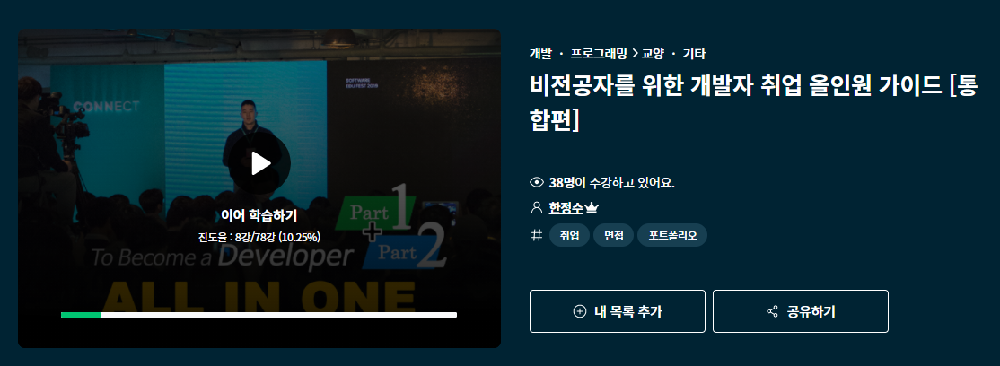

[비전공자를 위한 개발자 취업 올인원 가이드 [통합편]](https://www.inflearn.com/course/%EA%B0%9C%EB%B0%9C%EC%9E%90-%EC%B7%A8%EC%97%85-%ED%86%B5%ED%95%A9%ED%8E%B8#, "inflearn link")

며칠전 인프런 홈패이지에 있는 "비전공자를 위한 개발자 취업 올인원 가이드 [통합편]"
이란 강의가 나왔다는 이메일 알람을 받았습니다.

이미 프론트엔드 개발자로의 목표로 꾸준히 여러 정보들을 통해 배우고 있지만 
취업을 목적으로서는 여전히 자신이 무엇이 부족하고  배워야할지 확신이 안됬습니다.
그래서 이미 동일한 강사분이 제작한 eBook은 소장하고 있었지만 
좀 더 모던하고 좀 더 정확한 정보를 얻기위해 고민끝에 수강신청을 했습니다.
  

40을 넘긴 나이지만 새로운 영역에서 어엿한 개발자가 되고 싶네요.
마크다운 문법이 아직 익숙지 않지만 차차 적응 해보려합니다...

